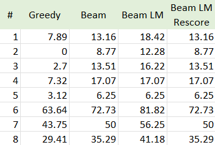
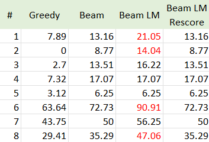
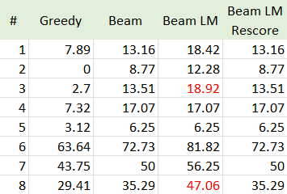
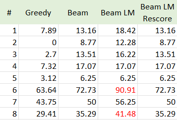
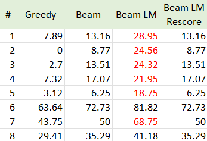
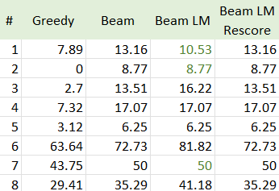
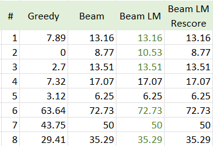
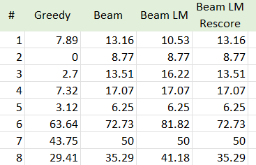

# ASR Decoding Report

### Task

**Part 1** of the task was to implement the following decoding methods:

- Greedy decoding
- Beam search decoding
- Beam search with LM scores fusion
- Beam search with a second pass LM rescoring

**Part 2** – experiment with a larger LM model 

**Part 3** – experiment with the following parameters: beam_width, alpha and beta

### Baseline 

Parameters: 
- `model_name="facebook/wav2vec2-base-960h"`
- `lm_model_path="3-gram.pruned.1e-7.arpa"`
- `beam_width=3`
- `alpha=1.0`
- `beta=1.0`

*WER table. Baseline* 
### Experiment: Larger LM
As suggested, we will use the larger 4-gram model for the experiments. It allows better context capture, capturing three preceding words. Folowing OFAT principle, we will keep the other parameters the same as in the baseline.

Parameters: 
- `model_name="facebook/wav2vec2-base-960h"`
- `lm_model_path="4-gram.arpa.gz"`
- `beam_width=3`
- `alpha=1.0`
- `beta=1.0`

*WER table. Larger LM* 

WER increased for beam_lm decoding. Other decoding methods showed no changes, because of absense or very low impact of LM model. Decrease in quality can be due to data sparsity and overfitting as 4-gram LM Needs ~1B+ tokens to avoid sparsity. Also 4-grams suffer from Zipf’s Law—most 4-grams occur rarely or never, leading to:

- Noisy probability estimates for unseen sequences.
- Overfitting to infrequent training data patterns.

There is also a problem of computational inefficiency. Slower 4-gram queries reduce the effective beam width, causing the decoder to miss better hypotheses.

### Experiment: Beam width
`beam_width` - Controls the number of candidate hypotheses retained at each decoding step. Higher values explore more potential transcriptions but increase computation/memory. Larger beams better handle ambiguous audio but require 2–3x more compute. Let us try to increase the beam width up to 5 and see whether it affects quality. If it does not positively affect quality, we will also conduct and experiment with reducing the beam width to 2, in order to assess the necessity of additional computations. We will not, however, reduce beam width to 1 as it is equivalent to greedy search and does not hold any value for the experiments (we already have greedy search WER).

Parameters: 
- `model_name="facebook/wav2vec2-base-960h"`
- `lm_model_path="3-gram.pruned.1e-7.arpa"`
- `beam_width=5` & `beam_width=2`
- `alpha=1.0`
- `beta=1.0`

 

*WER table. beam_width=5 & beam_width=2 respectively*

As we can see, the averageWER for `beam_width=5` is almost the same and somewhere even higher than the baseline. This indicates that the larger beam width does not improve the quality of the transcription. Decreasing to `beam_width=2` also did not make a positive impact. Therefore, we will use the baseline parameters for the remaining experiments.

### Experiment: Alpha

`alpha` - Balances acoustic model (AM) vs. language model (LM) confidence. Determines if decoding trusts acoustic signals (AM) or linguistic patterns (LM).
  - `total_score = AM_score + alpha * LM_score + beta * word_count`

Lower α (e.g., 0.5) is mostly usedif LM is weak/domain-mismatched; higher α (1.2–1.5) - if LM is strong. LM-Free Baseline can be achieved by setting alpha=0 to isolate AM performance. Thus, we will w=set up a number of experience that aim to assess the quality of impacr of LM on the model output.

Parameters: 
- `model_name="facebook/wav2vec2-base-960h"`
- `lm_model_path="3-gram.pruned.1e-7.arpa"`
- `beam_width=3`
- `alpha=1.5` & `alpha=0.5` & `alpha=0`
- `beta=1.0`

*WER table. alpha=1 & alpha=0.5 & alpha=0 respectively*

We expect changes in alpha to affect the quality of beam lm and beam lm rescore decoding. As we can see, the alpha=1.5 significaintly increased WER for beam_lm decoding. The alpha=0.5 and alpha=0, however improved quality with the latter making a greater change. It would make sense to continue the experiments with alpha=0. Likely the LM model is domain-mismatched and does not provide any benefit to the model.

### Experiment: Beta
`beta` - Encourages longer hypotheses by adding a fixed bonus per word. Controls output verbosity, critical for languages with compound words. Counteracts LM's tendency to prefer shorter outputs. As it would be impossible to measure impact of this parameter without LM, for the sake of experiment, we will set alpha to 0.5. Lower β reduces over-generation; higher β prevents under-generation.

Parameters: 
- `model_name="facebook/wav2vec2-base-960h"`
- `lm_model_path="3-gram.pruned.1e-7.arpa"`
- `beam_width=3`
- `alpha=0.5`
- `beta=0.5`

*WER table. alpha=0.5 & beta=0.5*

Changes in beta did not show any change in model quality. Highly likely because alpha is still low and, thus, impact of LM model is not significant.

### Conclusion

- We see that greedy search is the best option for this model. It has the lowest WER despite simplicity of ranking logic. 
- While 3-gram LMs balance context and reliability, 4-gram LMs require careful tuning to avoid sparsity and inefficiency.
- The role of alpha is significant. It allows to control the balance between AM and LM. LMs are not always beneficial in this equation.
- Experiments with beta make sense when alpha is high.

